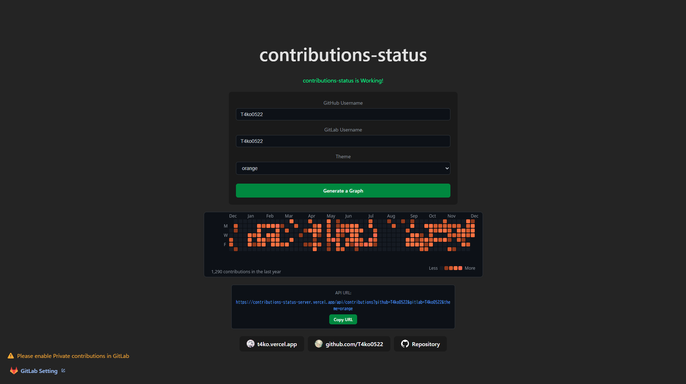
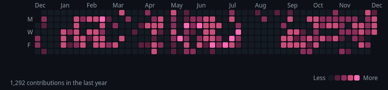

# contributions-status

A web application that integrates GitHub and GitLab contribution data and generates a 365-day contribution graph image.  

<a href="https://contributions-status.vercel.app/" target="_blank">
  
  
</a>

## Features

- Integrates and displays contributions from both GitHub and GitLab
- Supports 5 themes (default, gitlab, orange, red, pink)
- Generates a 365-day contribution graph as an image

## Tech Stack

### Frontend
- React 19
- Vite
- Tailwind CSS

### Backend
- Node.js
- Express 5
- TypeScript
- @napi-rs/canvas (for image generation)

## API Endpoint

### GET /api/contributions

Returns a 365-day contribution graph image combining GitHub and GitLab contributions.

#### Query parameters

- `github` (optional): GitHub username
- `gitlab` (optional): GitLab username
- `theme` (optional): Theme (default, gitlab, orange, red, pink). Default is `default`

**Note**: At least one of `github` or `gitlab` is required.

#### Example

```
GET https://contributions-status-server.vercel.app/api/contributions?github=T4ko0522&gitlab=T4ko0522&theme=pink
```

#### Response

- Content-Type: `image/png`
- Cache-Control: `public, max-age=3600` (1 hour cache)

## License

This project is licensed under the [Apache License 2.0](LICENSE)

## Author

[T4ko0522](https://x.com/T4ko0522)

## Link

- [GitHub Repository](https://github.com/T4ko0522/contributions-status)
- [Demo Site](https://contributions-status.vercel.app/)
